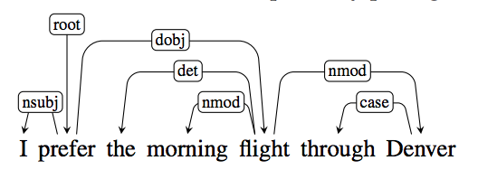
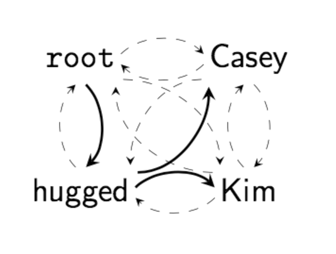
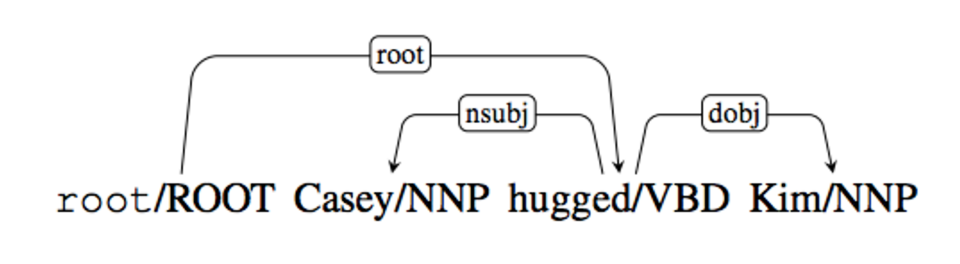

# Neural graph-based Dependency parser

In this project you will build a dependency parser from scratch!

## Introduction

In this project you will build a **graph-based dependency parser** that is trained using **neurals networks** with the help of **PyTorch**.

Concretely, you will:

* Read the relevant literature on dependency grammars, graph algorithms, and neural networks
* Use this to re-implement the model described in [Dozat & Manning (2017)](https://arxiv.org/abs/1611.01734), which is an extension of [Kiperwasser & Goldberg (2016)](https://aclweb.org/anthology/Q16-1023)
* Train this model on annotated data from the [Universal Dependencies project](http://universaldependencies.org/). Next to English, you will choose one other language to investigate. Ideally you choose a language that you are familiar with, so that you can interpret the performance of you model!
* Use the trained model to parse sentences in a test-set, and evaluate how well it performs
* Run a baseline dependency parser (that we provide) to get some scores. See if you can beat them with your own parser!

At the end of the project you will have a fully working parser! If time permits, you can do a number of interesting things with it:

* investigate its performance on very hard sentences (look [here](https://en.wikipedia.org/wiki/List_of_linguistic_example_sentences#cite_note-1) for inspiration!);
* inspect the trained neural network to see what it has learned;
* investigate the type of grammatical errors your parser makes;
* or you could even come up with an improvement to the model!

Read on for more details on the project.

## Dependency grammar

**Dependency grammar** is a grammatical formalism that is based on word-word relations. This means that the grammatical structure of a sentence is described solely in terms of the **words** in a sentence and the **syntactic relations** between the words.

Here is an example of a sentence annotated with dependency relations:

(We will refer to the above interchangeably as: a **dependency parse**; a **dependency graph**; and **dependency tree**.)

**Dependency parsing** is the task of taking a bare (unannotated) sentence like *I prefer the morning flight through Denver* and then assigning a syntactic structure to it. If our parser is good, it will assign (roughly) the parse in the image above.

## Graph algorithms

This project is about *graph-based* dependency parsing.

Concretely, this means we you will use a graph algorithm like [Chu-Liu-Edmonds' algorithm](https://en.wikipedia.org/wiki/Edmonds%27_algorithm) or [Eisner's algorithm](http://curtis.ml.cmu.edu/w/courses/index.php/Eisner_algorithm). These algorithms are used to find the so called **minimum-spanning-tree** [(MST)](https://en.wikipedia.org/wiki/Minimum_spanning_tree) in a graph. They are general graph algorithms used for all kinds of discrete optimisation tasks.

The way **we** will use these algorithms is as follows. Let's say we have a sentence. Our model assigns **weights** to **all possible arcs** between the words in the sentence (more below about how we get these weights). This gives us a **complete graph** on all the words in the sentence, with **weighted arcs**. Then, we use one of the above algorithms to obtain the minimum-spanning tree in this complete graph. What we obtain is the predicted **dependency tree** for the sentence under consideration.

The following image gives a good visual summary of the process for the sentence *Kasey hugged Kim*:

The dotted lines show the complete graph. Each of these is assigned a weight by our model. We then run the MST algorithm. The solid lines show the obtained minimum-spanning-tree. This gives use then the dependency parse:

Note: the **labels** on the arcs are **not** obtained using this algorithm. They are predicted afterwards. (We will discuss this later)

<!--
(for projective trees, suitable for languages such as English) and/or [Chu-Liu-Edmonds](https://en.wikipedia.org/wiki/Edmonds%27_algorithm) (for non-projective trees, languages such as German) to find the minimum-spanning tree (MST) given the weights your model assigns between each pair of words.
 More about this below!

The advantage of graph-based dependency parsers is that they can work well on languages with discontinuities,
such as Dutch and German, because we can extract non-projective dependency trees from them. -->

### Sources

* There is a python package for graphs called [NetworkX](http://networkx.github.io/) that has an easy to use data-structure for representing [graphs](https://networkx.github.io/documentation/stable/reference/classes/index.html)), and implementation of [Edmond's algorithm](https://networkx.github.io/documentation/stable/reference/algorithms/generated/networkx.algorithms.tree.branchings.Edmonds.html?highlight=edmonds) that you can use to check the correctness of your own implementation. Lastly, it let's you [draw](https://networkx.github.io/documentation/stable/reference/generated/networkx.drawing.nx_pylab.draw.html?highlight=draw#networkx.drawing.nx_pylab.draw) graphs, or [save](https://networkx.github.io/documentation/stable/reference/readwrite/graphml.html?highlight=xml) them as xml file so that you can draw them with other graph-drawing packages. See the [notebook](notebooks/graphs.ipynb) for a full demo.

## Neural networks

For the method above to work well, we need to assign **weights** to all the possible edges. These weights are crucial for obtaining good parses; they essentially control which tree we obtain! But how do get them? For this we will use a **neural network**.

`[Under development]`

### Sources

In this section we collect sources that we think are useful for understanding the neural network methods used in this projects.

(Note that you are by no means required to read them all! Browse them and see for yourself which sources you find useful - and until you found what you needed.)

* Word embeddings
  * [Chapter 15](https://web.stanford.edu/~jurafsky/slp3/15.pdf) and especially [chapter 16](https://web.stanford.edu/~jurafsky/slp3/16.pdf) of Jurafsky and Martin (3rd edition) contains background on the idea of using vector representations for words.
  * The [notebook on word embeddings](notebooks/word-embeddings.ipynb) we looked at in the tutorial.
  * The PyTorch documentation on [sparse layers](http://pytorch.org/docs/master/nn.html#embedding) in the NN module (which in particular contains the class `Embedding`).

* [Recurrent Neural Networks](https://en.wikipedia.org/wiki/Recurrent_neural_network) (RNNs) and [LSTMs](https://en.wikipedia.org/wiki/Long_short-term_memory) (LSTM stands for *Long short-term memory*. For clarity: an LSTM is a special type of RNN).
  * [The Unreasonable Effectiveness of Recurrent Neural Networks](http://karpathy.github.io/2015/05/21/rnn-effectiveness/) by Andrej Karpathy.
  * [Understanding LSTM Networks](http://colah.github.io/posts/2015-08-Understanding-LSTMs/) on Christopher Olah's blog.
  * [These lecture notes](http://cs224d.stanford.edu/lecture_notes/notes4.pdf) from the Stanford course Deep Learning for NLP.

* Pytorch implementations
  * This [PyTorch tutorial](http://pytorch.org/tutorials/intermediate/char_rnn_classification_tutorial.html), which has a simple implementation of an RNN.
  * Another [PyTorch tutorial](http://pytorch.org/tutorials/beginner/nlp/sequence_models_tutorial.html?highlight=lstm) on how to use and LSTM for POS-tagging (without an HMM, Viterbi, or the forward-backward probabilities!).
  * The PyTorch documentation on [recurrent layers](http://pytorch.org/docs/master/nn.html#recurrent-layers) in the NN module.

## Required readings

The following sources are the theoretical backbone of the project:

1. J&M 3rd edition, chapter [Dependency parsing](Jurafsky&ManningCh14.pdf). Skip section 14.4 for now. In this section a so called *transition*-based parsing method is discussed; we will focus on the *graph*-based parsing method introduced in section 14.5.
2. [Kiperwasser & Goldberg (2016)](Kiperwasser&Goldberg2016.pdf)
3. [Dozat & Manning (2017)](Dozat&Manning2017.pdf) (also see their [poster](TDozat-ICLR2017-Poster.pdf) and [slides](TDozat-CoNLL2017-Presentation.pdf)!)

We advice you to read them in this order, especially the last two papers: Dozat & Manning (2017) is an extension of the model of Kiperwasser & Goldberg (2016), and the former presupposes a lot of knowledge of the latter.

Note that The Kiperwasser & Goldberg paper is rather dense, but very complete. It contains condensed but very good explanations of all the techniques and steps taken in the implementation. So study this paper carefully! Then the extension that Dozat & Manning propose will make a lot more sense.
